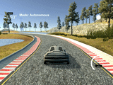

# **Behaviorial Cloning**

Project to teach a car how to drive by first gathering data navigating a car around a track and then using a convolutional neural network to learn correct steering angles for camera images of car's front view.

Full description of problem and task: [TASK.md](TASK.md)  
Source code (NN training): [model.py](model.py)  
Execution: python drive.py model.h5  
Writeup: [WRITEUP.md](WRITEUP.md)  
Videos: [videos/](videos/)

## Demo of Autonomous Car:

