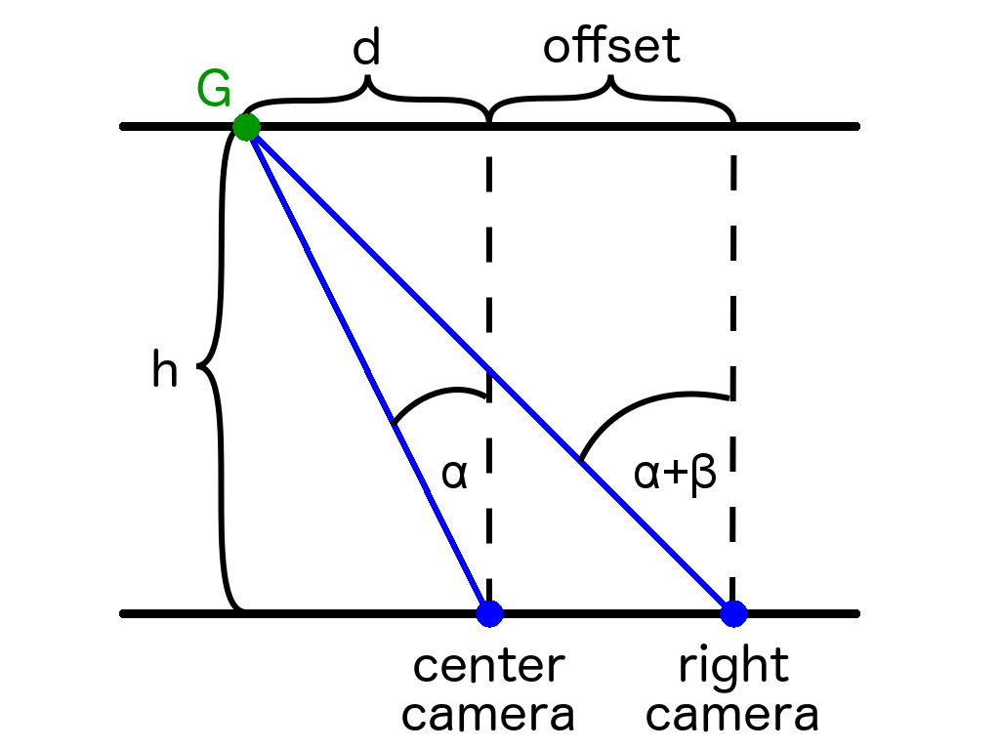
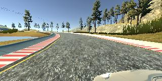
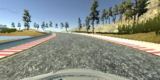
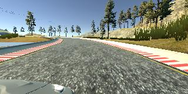
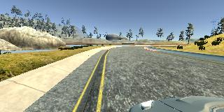
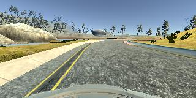
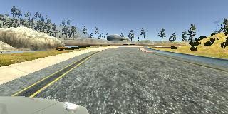

# **Behavioral Cloning** 

## Writeup Template

### You can use this file as a template for your writeup if you want to submit it as a markdown file, but feel free to use some other method and submit a pdf if you prefer.

---

**Behavioral Cloning Project**

The goals / steps of this project are the following:
* Use the simulator to collect data of good driving behavior
* Build, a convolution neural network in Keras that predicts steering angles from images
* Train and validate the model with a training and validation set
* Test that the model successfully drives around track one without leaving the road
* Summarize the results with a written report


## Rubric Points
### Here I will consider the [rubric points](https://review.udacity.com/#!/rubrics/432/view) individually and describe how I addressed each point in my implementation.  

---
### Files Submitted & Code Quality

#### 1. Submission includes all required files and can be used to run the simulator in autonomous mode

My project includes the following files:
* model.py containing the script to create and train the model
* drive.py for driving the car in autonomous mode
* model.h5 containing a trained convolution neural network 
* video.mp4 showing the car's center camera for one lap 
* WRITEUP.md summarizing the results

#### 2. Submission includes functional code
Using the Udacity provided simulator and my drive.py file, the car can be driven autonomously around the track by executing 
```sh
python drive.py model.h5
```

#### 3. Submission code is usable and readable

The model.py file contains the code for training and saving the convolution neural network. The file shows the pipeline I used for training and validating the model, and it contains comments to explain how the code works.

### Model Architecture and Training Strategy

#### 1. An appropriate model architecture has been employed

My model is based on the Nvidia network used in their paper "End to End Learning for Self-Driving Cars"[1]. Two preprocessing layers make sure that the network can process the original data as it receives it from the simulator. After each fully connected layer, I added a dropout of 10% to help with generalization.


#### 2. Attempts to reduce overfitting in the model

The model contains dropout layers in order to reduce overfitting. 

The model was trained and validated on different data sets (0.8 and 0.2 split respectively) to ensure that the model was not overfitting. The model was tested by running it through the simulator and ensuring that the vehicle could stay on the track.

#### 3. Model parameter tuning

The model used an adam optimizer, so the learning rate was not tuned manually.
The rest of the hyperparameters were chosen empirically by looking for the best validation set performance.

#### 4. Appropriate training data

Training data was chosen to keep the vehicle driving on the road. I used a combination of center lane driving, recovering from the left and right sides of the road and turn focused driving.

For details about how I created the training data, see the next section. 

### Model Architecture and Training Strategy

#### 1. Solution Design Approach

The overall strategy was to have a sufficiently complex model and find a good data set to successfully drive the track.

Since the Nvidia network has been shown to work well for this problem I sticked to this network for this project.

In order to gauge how well the model was working, I split my image and steering angle data into a training and validation set. The validation error was used to tuned the hyperparameters:
* number of epochs: 3
* pixels to crop from top and bottom of image: 70 top, 26 bottom
* adjustment of angle for left and right images: see below
* batch size: 32
* amount of dropout: 0.1

Dropout considerably helped in generalizing and avoiding overfitting.

The hardest part was to find a good data set that can be used to teach the car to drive the track. I iteratively added single turns to the data set to see how and what improves performance until I found a good enough mixture.

The recovery laps introduced some "wiggly" motions during straight driving, but overall helped in completing the track. This might indicate that the data collection of recovery laps could be improved (i.e., a different driving style for recovery laps might be appropriate).

At the end of the process, the vehicle is able to drive autonomously around the track without leaving the road.


#### 2. Final Model Architecture

The Nvidia network architecture was barely changed throughout the process of the project. The only change was the addition of dropout layers and the preprocessing layers that first crop the image (70 pixels from top and 26 pixels from bottom) and then normalize it to zero mean and unit norm.

Since the network showed good results there was no need to try out other architectures.

The following table shows the final network architecture:

| Layer         		|     Description	        					    | 
|:---------------------:|:-------------------------------------------------:| 
| Input         		| 160x320x3 RGB image   						    | 
| Cropping              | Crops the images at the top and bottom            | 
| Normalizing           | Normalizes the images to zero mean and unit norm  | 
| Convolution 5x5     	| 2x2 stride, valid padding, 24 feature maps        |
| RELU					|												    |
| Convolution 5x5     	| 2x2 stride, valid padding, 36 feature maps        |
| RELU					|												    |
| Convolution 5x5     	| 2x2 stride, valid padding, 48 feature maps        |
| RELU					|												    |
| Convolution 3x3     	| 1x1 stride, valid padding, 64 feature maps        |
| RELU					|												    |
| Convolution 3x3     	| 1x1 stride, valid padding, 64 feature maps        |
| RELU					|												    |
| Fully connected		| 120 units        								    |
| RELU					|												    |
| Dropout               | 10% during training							    |
| Fully connected		| 50 units        								    |
| RELU					|												    |
| Dropout               | 10% during training							    |
| Fully connected		| 10 units        								    |
| RELU					|												    |
| Dropout               | 10% during training							    |
| Fully connected		| 1 units, output layer	                            |
 

#### 3. Creation of the Training Set

To capture good driving behavior, I recorded
* 4 laps of center lane driving,
* 2 laps of vehicle recovery and
* 1 lap of carefully driving turns
on track 1.

In addition to that I repeated the process by driving track 1 in reversed order doubling the amount of data.

During training a data generator is used to augment the data set in two ways:
* flipping images and steering angles and 
* using left and right camera images and adjusting the steering angle
increasing the data size by a factor of six.

The generator chooses a mini-batch randomly from all possible augmentation combinations and data samples everytime it is called. This is done without repetition until the data set is exhausted for a given epoch.

While flipping the images horizontally and inverting the steering angle is trivial, I chose to develop a more precise method to adjust the steering angle when using the left/right cameras instead of adding a constant.

The following figure shows the setup of the car's cameras and the steering angle alpha we get from the data. That angle defines a staight line of the direction we want the car to go. By defining a goal point G along the line, we can calculate the adjustment we have to add to the left and right camera angle using trigonometry.



We know that
* tan(alpha) = d / h
* tan(alpha + beta) = (d + offset) / h  
which can be combined to give
* alpha + beta = arctan(tan(alpha) + offset / h).

beta is the adjustment angle and alpha + beta is the new angle we use for the left or right image. offset defines the distance of the right/left camera to the center but can be chosen as unit 1 so that the only remaining hyperparameters is h which is the vertical distance of the goal G to the car (in "offset" units when offset is 1).
The smaller the h, the bigger the adjustment of the left/right camera steering angles and the bigger h the smaller the adjustment.
The advantage of this calculation of the angle adjustment is that is takes into account the center steering angle alpha. This makes sense because the adjustment should be different depending on whether the car is going straight or already turning in a certain direction.

The hyperparameter h was empirically chosen to be 20.

Here are some examples of the training data and the calculated angles for left/right images:



Left Angle: 0.238&deg;, Center Angle: -2.625&deg;, Right Angle: -5.475&deg;



Left Angle: 8.001&deg;, Center Angle: 5.175&deg;, Right Angle: 2.323&deg;

## References
1. M. Bojarski, D. Del Testa, D. Dworakowski, B. Firner, B. Flepp, P. Goyal, L. D. Jackel, M. Monfort, U. Muller, J, Zhang, X. Zhang, J. Zhao and K. Zieba. End to End Learning for Self-Driving Cars. 2016.
